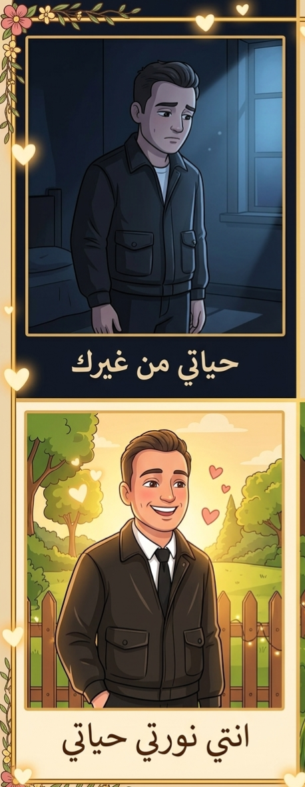
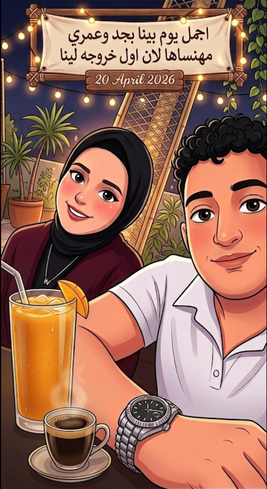

<!DOCTYPE html>
<html lang="ar" dir="rtl">
<head>
    <meta charset="UTF-8">
    <meta name="viewport" content="width=device-width, initial-scale=1.0">
    <title>مملكة نونتي ❤️</title>
    <link href="https://fonts.googleapis.com/css2?family=Cairo:wght@400;700&family=Amiri:ital,wght@1,700&display=swap" rel="stylesheet">
    
    
</head>
<body onclick="createHeart(event)">
    <canvas id="stars"></canvas>
    

    

        

            <h2 style="color: var(--p)">عالم نونتي ❤️</h2>
            <input type="text" id="pass" placeholder="Password...">
             
            <button class="main-btn" onclick="unlock()">فتح عالمنا ❤️</button>
        

    

    

        <h1 style="font-family: 'Amiri'; font-size: 2.5em; color: var(--p);">وحشتيني يا نونتي ❤️</h1>
        

            
إحنا مع بعض بقالنا بالثانية:

            

                
0 أيام

                
0 ساعات

                
0 دقائق

                
0 ثواني

            

        

        

            
راديو الحب 🎵 (اختاري أغنيتنا)

            <button class="song-btn active" onclick="playSong('xMQieNosdII', this)">بيت كبير 🏠</button>
            <button class="song-btn" onclick="playSong('D5uGY-m7iDE', this)">إضحكي 😊</button>
            <button class="song-btn" onclick="playSong('NoQnWLgTDSE', this)">كلك عاجبني 😉</button>
            <button class="song-btn" onclick="playSong('nXoJDHUC63I', this)">أصابك عشق 💘</button>
        

        <button class="main-btn" style="background: white; color: var(--p);" onclick="kissSurprise()">ابعتيلي بوسة هنا 💋</button>
        

            

❤️

عشان حنيتك اللي بتطمن قلبي وتنسيني الهم

            

🤝

عشان جدعنتك اللي خلتني أحس إن في ظهري جبل

            

😂

عشان ضحكتك هي اللي بتنور دنيتي وتفرحني

            

👑

عشان إنتي "نونتي" الأميرة اللي حلمت بيها

            

🌸

عشان روحك الحلوة اللي بتخلي كل حاجة أجمل

            

🧠

عشان عقلك وتفكيرك اللي بيفهمني من غير كلام

            

💎

عشان أصلك الطيب وجوهرك الغالي اللي ملوش ثمن

            

♾️

عشان وجودك في حياتي هو أكبر نعمة من ربنا

        

        

            

البداية ❤️

            

نورتي دنيتي ✨

            

أجمل ذكرياتنا 😍

        

        

            
بحبك يا نونتي ❤️

            <button class="main-btn" onclick="showMsg()">رسالة جديدة ليكي ✨</button>
        

        <button class="main-btn" id="l-btn" onclick="startTyping()">افتحي الجواب السري ليكي ✉️</button>
        

    

    
</body>
</html>
